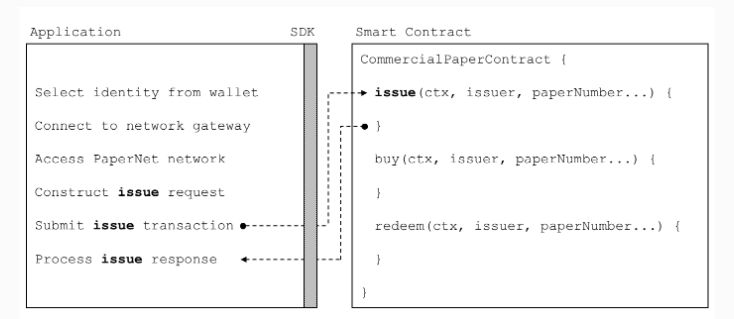

#### 商业票据
 比如现在有6个组织，这些组织都通过hyperledger Fabric的商业纸质网络PaperNet来发行，购买和兑换商业票据。

 - PaperNet网络
 PaperNet是一个商业票据网络，允许适当授权的参与者发行，交易，赎回和评价商业票据。

现在目前有六家组织使用PaperNet网络发行，购买，出售，兑换和评估商业票据。MagentoCorp发行和兑换商业票据。DigiBank，BigFund，BrokerHouse和HedgeMatic都相互交易商业票据。RateM为商业票据提供各种风险衡量标准。

- 场景

MagnetoCorp是一家备受推崇的公司，生产自动驾驶电动车。在2020年4月初，MagnetoCorp赢得了为Daintree制造10,000辆D型车的大订单，但是在MagnetoCorp与Daintree正式达成协议后六个月，Daintree将于11月1日开始交付车辆之前不必支付车辆费用，就是在11月1日交车之前，Daintree不付给MagnetoCorp任何费用。

为了制造这些车辆，MagnetoCorp将需要雇用1000名工人至少6个月。 每月就需要支付500万美元来雇佣这些新员工。商业票据旨在帮助MagnetoCorp克服其短期融资需求 - 通过这个短期融资，给员工发工资。

5月底，MagnetoCorp需要500万美元才能满足5月1日雇用的额外工人的工资。为此，它发行面值为500万美元的商业票据，到期日为6个月 。另一家组织DigiBank认为MagnetoCorp信誉良好，因此，它以4.94M美元的价格购买了MagnetoCorp 6个月的商业票据（相当于股票，每一股4.9美元） - 与其价值495万美元相比略有折扣。DigiBank完全预计它将能够在6个月内从MagnetoCorp赎回500万美元，因此承担与此商业票据相关的风险增加，使其获利10,000美元。

6月底，这是因为6月的商业条件与5月大致相同，MagnetoCorp又发行500万美元的新商业票据以满足6月份的工资单时，它被BigFund以4.94M美元的价格购买。

随后的每个月，MagnetoCorp都可以发行新的商业票据来支付其工人的工资，这些可以由DigiBank或​​PaperNet商业票据网络中的任何其他参与者购买 - BigFund，HedgeMatic或BrokerHouse。根据两个因素 - 中央银行基准利率和与MagnetoCorp相关的风险，这些组织可能会为商业票据支付更多或更少的费用。后一个数字取决于各种因素，例如D型车的生产，以及评级机构RateM评估的MagnetoCorp的信誉度。

PaperNet的组织有不同的角色，MagnetoCorp发行纸张，DigiBank，BigFund，HedgeMatic和BrokerHouse交易文件和RateM费率纸。具有相同角色的组织，如DigiBank，Bigfund，HedgeMatic和BrokerHouse，都是竞争对手。不同角色的组织不一定是竞争对手，但可能仍然存在相反的商业利益，例如MagentoCorp希望其纸张的高评级以高价出售它们，而DigiBank将从低评级中受益，这样它就可以购买他们以低廉的价格。可以看出，即使像PaperNet这样看似简单的网络也可能存在复杂的信任关系。区块链可以帮助在竞争对手或具有可能导致争议的商业利益的组织之间建立信任。

###### 1. 商业纸张生命周期
```
Issuer = MagnetoCorp
Paper = 00001
Owner = MagnetoCorp
Issue date = 31 May 2020
Maturity = 30 November 2020
Face value = 5M USD
Current state = issued

发行者 MagnetoCorp
Paper 00001
所属者 MagnetoCorp
发行日期 31 May 2020
有效期 30 November 2020
面值 5M USD
当前的状态 发行
```
唯一标识是 Issuer和Paper属性的组合```MagnetoCorp00001```。

- 发行不久被DigiBank收购,商业票据的变化

```
Issuer = MagnetoCorp
Paper = 00001
Owner = DigiBank
Issue date = 31 May 2020
Maturity date = 30 November 2020
Face value = 5M USD
Current state = trading
```
商业票据的所属者和当前状态发生了变化，所属者变成DigiBank，状态变为```交易```。

如果6个月有效期到了之后，如果DigiBank仍然持有商业票据，它可以去兑换它，这时的商业票据就：
```
Issuer = MagnetoCorp
Paper = 00001
Owner = MagnetoCorp
Issue date = 31 May 2020
Maturity date = 30 November 2020
Face value = 5M USD
Current state = redeemed
```
所属者变回了MagnetoCorp，当前的状态变成```赎回```。

最终的赎回交易结束了商业票据的生命周期。Fabric通过getCreator()<a href='https://github.com/hyperledger/fabric-chaincode-node/blob/master/fabric-shim/lib/stub.js#L293'>chaincode API</a>支持此 功能。如果将golang用作链代码语言， 则可以使用<a href='https://github.com/hyperledger/fabric/blob/master/core/chaincode/shim/ext/cid/README.md'>客户端身份链代码库</a>来检索事务创建者的其他属性。

###### 2. Transactions交易
纸00001的生命周期在 issued , trading, redeemed中移动。
这三笔交易由MagnetoCorp和DigiBank（两次）发起，并推动了00001纸张的状态变化。

###### 3. Issue 发行事务

发行事务的交易结构与00001的结构不同：
```
Txn = issue
Issuer = MagnetoCorp
Paper = 00001
Issue time = 31 May 2020 09:00:00 EST
Maturity date = 30 November 2020
Face value = 5M USD
```
这是因为它们是不同的东西，纸张00001反映了PaperNet的状态，这是发行交易的结果。这是issue交易背后的逻辑，它用这些属性并创建了这些文本。参与发行事务的是MagnetoCorp，他需要签署交易，一般纸张发行人必须签署发行新纸张的交易。

###### 4. bug购买
DigiBank购买MagnetoCorp发行的00001的所有权。

buy 交易纸张中的最终属性和内容：
```
Txn = buy
Issuer = MagnetoCorp
Paper = 00001
Current owner = MagnetoCorp
New owner = DigiBank
Purchase time = 31 May 2020 10:00:00 EST
Price = 4.94M USD
```
Purchase time是采购时间。 购买交易最重要的是所有权的变更，（分类帐将记录两条信息 - 影响本文的所有交易的历史记录，以及最新的状态）。

如果HedgeMatic后续购买：
```
Txn = buy
Issuer = MagnetoCorp
Paper = 00001
Current owner = BigFund
New owner = HedgeMatic
Purchase time = 3 June 2020 15:59:00 EST
Price = 4.90M USD
```

###### 5. Redeem 赎回
```
Txn = redeem
Issuer = MagnetoCorp
Paper = 00001
Current owner = HedgeMatic
Redeem time = 30 Nov 2020 12:00:00 EST
```

###### 6. The Ledger 账本
在本主题中，我们已经看到了交易和由此产生的纸张状态是PaperNet中最重要的两个概念。实际上，我们将在任何Hyperledger Fabric分布式<a href='https://hyperledger-fabric.readthedocs.io/en/release-1.4/ledger/ledger.html'>分类帐</a>中看到这两个基本元素 - 一个包含所有对象的当前值的世界状态，以及一个记录导致当前世界状态的所有事务的历史记录的区块链。

交易所需的签字通过规则强制执行，规则在将交易附加到分类帐之前进行评估。仅当存在所需的签名时，Fabric才会接受有效的交易。


#### 商业票据的应用

###### 1. 应用
<a href='https://hyperledger-fabric.readthedocs.io/en/release-1.4/developapps/application.html'>商业票据的应用</a>

PaperNet应用程序调用商业票据智能合约来提交问题交易请求。

应用程序必须遵循六个基本步骤来提交事务：

从钱包中选择一个身份
连接到网关
访问所需的网络
构建智能合约的交易请求
将交易提交到网络
处理响应
