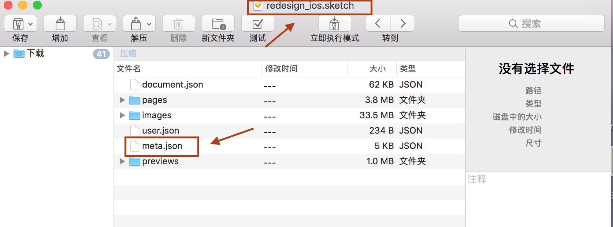
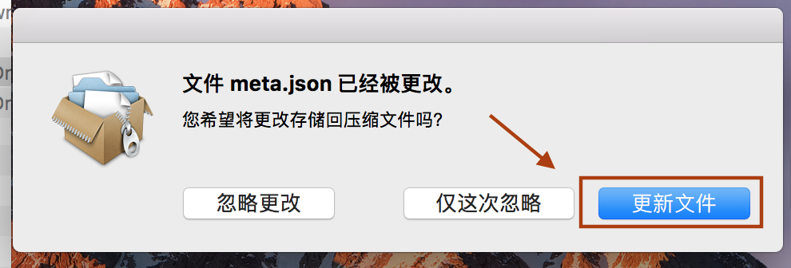
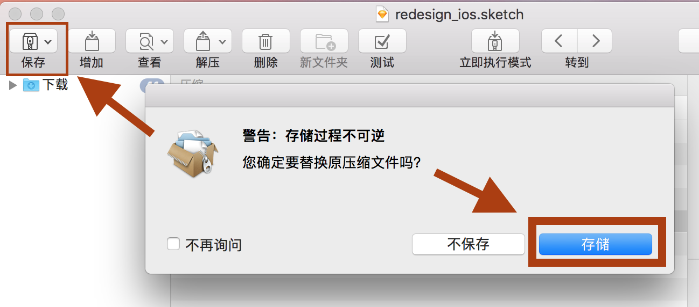

# Sketch打开高版本文件

当我们下载下来的高版本sketch文档，然后用低版本的sketch来打开的时候，就会有提示让我们升级Sketch到最高版本，否者就打不开。

破解原理：
sketch文件实际是一种格式的压缩包，每次打开的时候，Sketch检查了一下里面的文件，进行了一个判断，主要判断的是

<strong>commit，appVersion，build，version</strong>

这四个字段里面的东西,我们先查看一下自己的能打开的sketch文件，然后将不能打开的sketch版本相对应的地方替换就可以了。

##### sketch的43.1版本打开46.2的版本。

在mac上先下载betterZip软件，然后在```betterZip```中打开```*.sketch```文件，直接把要打开的文件拖进```betterZip```即可。



会解析成一下文件，然后更改```meta.json```文件的内容就可以了。将你可以打开的sketch的文件的```meta.json```的内容，全部替换到46.2版本的```meta.json```中就可以了。

替换的时候会弹出以下内容，点击更新文件。


然后点击保存：


然后再打开原文件就可以了。

###### 43.1版本的meta.json的内容：
```
{"commit":"335a30073fcb2dc64a0abd6148ae147d694c887d","appVersion":"43.1","build":39012,"app":"com.bohemiancoding.sketch3","pagesAndArtboards":{"13881411-5A3E-4288-B0B3-FB971FEBF006":{"name":"Page 1","artboards":{"ACE2666D-FDF2-4E2C-B919-E974D7D1FBD1":{"name":"play\/ic_launcher_APP"},"94A32438-6BD1-4025-982E-151B0E70E0A1":{"name":"xhdpi\/ic_launcher_APP"},"34983A16-FB0E-4604-9893-6D58DC52204B":{"name":"mdpi\/ic_launcher_APP"},"8A9680E1-6C2D-46FE-92EB-BB4B5F6FAE5B":{"name":"xxxhdpi\/ic_launcher_APP"},"1A61FFF7-7989-4B6A-9E32-E6BC103ACB34":{"name":"xxhdpi\/ic_launcher_APP"},"AF2F3359-EA93-4533-A6FF-8AF53F272E74":{"name":"hdpi\/ic_launcher_APP"}}}},"fonts":["HelveticaNeue-Light"],"created":{"app":"com.bohemiancoding.sketch3","commit":"335a30073fcb2dc64a0abd6148ae147d694c887d","build":39012,"appVersion":"43.1","variant":"NONAPPSTORE","version":88},"version":88,"saveHistory":["NONAPPSTORE.39012"],"autosaved":0,"variant":"NONAPPSTORE"}
```
